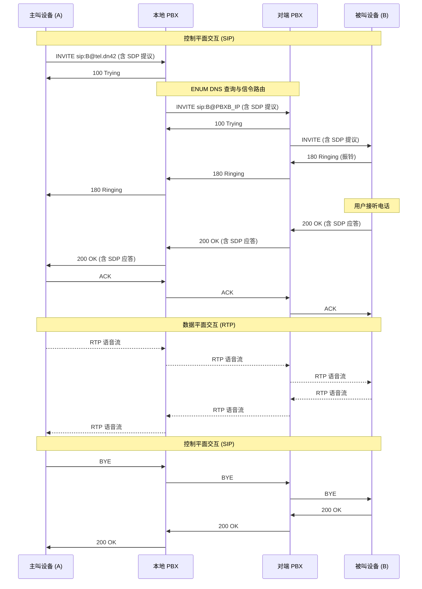
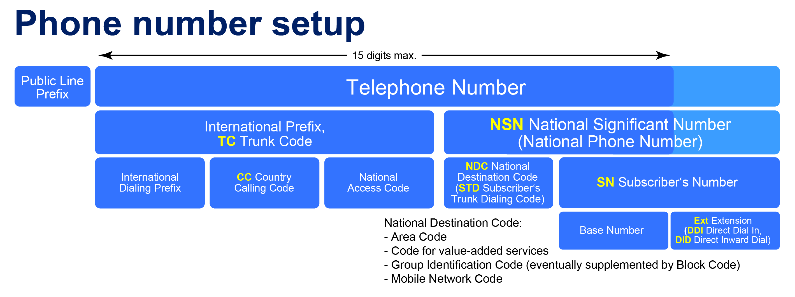
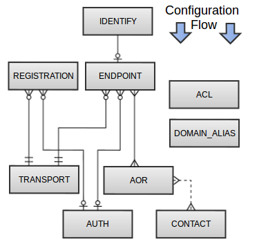
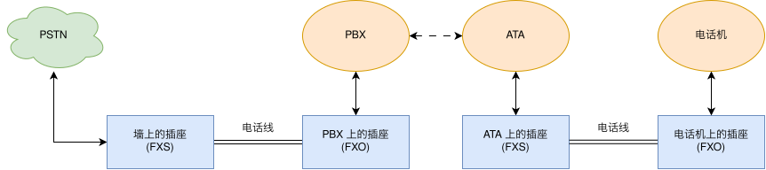
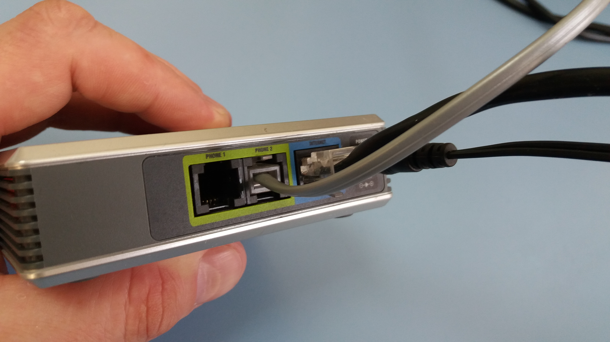
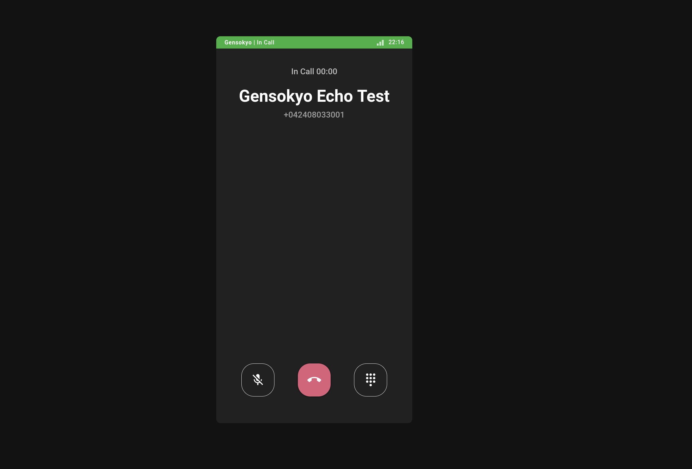


注：此处的“完全”意为“较完全”，不作对前置知识和相关配置 100% 覆盖的担保，亦不保证读者在阅读完毕后能立即动手实现本文涉及的所有功能。



注：本文列出的示例配置为演示方便，在原配置上进行了一些修改，仅供参考，不保证能在简单的复制粘贴后立即正常工作。


先前的博客文章 [在 telephony42 中配置 E.164 ENUM](https://0x7f.cc/e164-dn42/) 提到了，我们在 dn42 上初步搭建了一套实验性质的去中心化电话网络。那时的 telephony42 还处于比较草台班子的实验阶段，诸多问题尚未达成共识，缺乏统一的规范。

[经过社区漫长的讨论、妥协与重构](https://groups.io/g/dn42/topic/addition_of_e164/119292241)，2026 年 6 月 20 日，telephony42 的 [Registry Schema 提案](https://git.dn42.dev/dn42/registry/pulls/6522) 终于被合并。

这意味着 telephony42 终于脱离了测试服阶段，成为了 dn42 Registry 的组成部分。现在，任何 dn42 参与者都可以像注册 ASN 和 IP 段一样，在 dn42 Registry 里申请全网唯一的电话号码前缀了。

随着 Schema 的合并，大量新玩家不断涌入。对于精通 BGP 路由和 WireGuard 隧道的 dn42 NOC 们来说，拉起一条跨国隧道网络就是敲几行命令或写几段代码的事情；但面对上个世纪遗留下来的电信概念、复杂的 SIP 信令栈，以及 VoIP 领域的玄学问题时，往往会感到一头雾水，无从下手。

因此，本指南旨在取代之前关于 telephony42 的旧文，尽可能详细地解析如何在新的 `tel.dn42` 框架下，构建属于自己的电话网络。

## 基础概念

在实际配置自己的电话网络之前，必须先对要搭建的东西有一个大概的认识。

电话网络本质上就是一个具有独特路由规则的应用层网络。让我们认识一些马上就会用到的前置定义。

### 一些组件

- [PBX (Private Branch Exchange - 私有交换机)](https://en.wikipedia.org/wiki/Business_telephone_system)
    可以将其视作 VoIP 网络中的路由器，负责处理信令和路由，有时也处理语音数据。呼叫路由、分机接入、传递信令、语音信箱等各种各样的任务均能由其承担。
    它有各种各样的软件和硬件实现，有的会自带 RJ11 电话接口，有的则允许通过软件插件或硬件模块扩展功能，并可通过硬件接口连接到其他交换网络。Asterisk、FreeSWITCH 均属于软件 PBX 的代表。
- [B2BUA (Back-to-Back User Agent - 背靠背用户代理)](https://en.wikipedia.org/wiki/Back-to-back_user_agent)
    Asterisk 之类的 PBX 就是一个典型的 B2BUA。与仅转发信令的 SIP 代理不同，当 A 通过 PBX 呼叫 B 时，PBX 实际上是先以被叫的身份接听了 A 的电话，然后再以主叫的身份向 B 发起一通全新的电话，最后在内部把这两个独立的通道桥接起来。这使得 PBX 能随时介入通话过程，进行录音、转码、甚至强制掐线。
- Endpoint (终端设备)
    任何可以发起或接收呼叫的设备。它可以是电脑上的软件电话应用、桌面的实体 IP 电话机、ATA、网页上的 WebRTC 电话，甚至是另一个网络的 PBX。
- [ATA (Analog Telephone Adapter - 模拟电话适配器)](https://en.wikipedia.org/wiki/Analog_telephone_adapter)
    一个自带网口（RJ45）和电话线接口（RJ11）的设备。它本质上也是一个 Endpoint，作用相当于调制解调器，可以把传统的模拟电话机、传真机的模拟电信号，数字化为 SIP 报文和 RTP 媒体流。借助这个设备，即使是几十年前的上古拨盘电话，通过恰当的转换，也能接入最新最热的 telephony42 网络。

> Registrar、SBC、Media Gateway、SIP Proxy 等细分概念，由于在本文中已被 Asterisk 这个 All-in-One 软件完全囊括，为了降低读者中途放弃的可能，暂不专门涉及。

### 一些协议

VoIP 的控制平面和数据平面通常是分离的，这也是抓包时最容易使人迷惑的地方。总的来说，搭建 telephony42 的电话系统，通常会接触到以下几种协议：

- [会话发起协议 (SIP - RFC 3261)](https://datatracker.ietf.org/doc/html/rfc3261)
  作为控制平面。采用纯文本格式，长得有点像 HTTP，包含 URI、头字段和正文。主要负责信令传输，例如传递呼叫的来源和目标、接通、挂断或拒接等，不负责传输具体的语音流。SIP 默认监听于 UDP/TCP 5060 端口（在报文较大时通常优先使用 TCP），TLS 加密状态下监听 TCP 5061 端口。
- [实时传输协议 (RTP - RFC 3550)](https://datatracker.ietf.org/doc/html/rfc3550)
  作为数据平面。当 SIP 握手与 SDP 协商完成后，双方会在协商好的高位动态端口（通常在 UDP 10000 至 20000 之间）激情互喷 RTP 数据包。这些包对延迟和抖动极其敏感。如果防火墙只放行了 SIP (5060) 但没放行 RTP，就会遇到 VoIP 史上最著名的故障： 单通（接通了但听不到声音）。
- [实时传输控制协议 (RTCP - RFC 3550)](https://datatracker.ietf.org/doc/html/rfc3550)
  与 RTP 伴生的控制协议。它也不承载任何媒体流数据，功能是在 RTP 邻近端口（通常为 RTP 端口 + 1）周期性地传输控制统计包，从而收集通话期间的丢包率、抖动、单向传输延迟等服务质量数据，为 PBX 或终端调整前向纠错及缓冲区提供依据。
- [会话描述协议 (SDP - RFC 4566/8866)](https://datatracker.ietf.org/doc/html/rfc8866)
  夹带在 SIP 报文体中的清单数据。它的作用类似于 BGP 的 Capability 协商。通过 SDP，双方互相宣告各自支持的音频编码、采样率，以及准备用来接收语音的 IP 地址和动态端口。

下面这个序列图展示了一个典型的跨网 SIP 呼叫建立与 RTP 媒体流传输的过程：



除此之外，根据折腾程度，还可能接触到：

- [安全实时传输协议 (SRTP - RFC 3711)](https://datatracker.ietf.org/doc/html/rfc3711)
  RTP 本身是明文裸奔，沿途任何一个路由器抓个包就能还原出完整的通话录音，而 SRTP 可以对语音数据负载进行加密。在跨越不受信任的网络时，强制启用 SRTP 是保护隐私的重要手段。
- [Inter-Asterisk eXchange Version 2 (IAX2 - RFC 5456)](https://datatracker.ietf.org/doc/html/rfc5456)
  这是 Asterisk 的私有协议。与 SIP 的控制与数据分离不同，IAX2 将信令和语音媒体流复用在同一个 UDP 4569 端口上，因此能够轻易穿透复杂的 NAT 环境，并且能够将多个通话捆绑在一个 Trunk 里进行传输以节省开销。如果两端都是使用 Asterisk 互联，采用 IAX2 实际上比 SIP 更为方便。
- [STUN (RFC 3489/5389/8489)](https://datatracker.ietf.org/doc/html/rfc8489) / [TURN (RFC 5766/8656)](https://datatracker.ietf.org/doc/html/rfc8656) / [ICE (5245/8445)](https://datatracker.ietf.org/doc/html/rfc8445)
  解决 NAT 问题的三大协议族。STUN 服务器让内网设备知道自己映射的外部 IP 是什么；TURN 服务器提供中继，让通话双方强行连通；ICE 则是一个调度框架，负责在直连、内网、中继之间测试并选出最优路径。

### 一些概念

#### 网络与路由

- [Trunk (中继)](https://en.wikipedia.org/wiki/SIP_trunking) 是两个 PBX 之间的连接通道。不同于只能单路通话的分机，Trunk 允许多个并发通话，是跨域路由的基础。这个概念与 VLAN 中的 Trunk 有一定相似之处。
- [Dialplan (拨号计划)](https://en.wikipedia.org/wiki/Dial_plan) 是电话路由系统的本体。本质上是一坨按顺序执行的脚本规则，不仅能按照模式匹配路由呼叫，还能随意修改请求中的参数或执行自定义操作，十分灵活。
- [ENUM (E.164 Number Mapping)](https://en.wikipedia.org/wiki/Telephone_number_mapping) 是一种自动发现路由的机制。当拨打目标是未知目的地的电话时，PBX 会根据号码查询 DNS 的 NAPTR 记录，查找到该号码对应的 SIP 目标地址（例如 `sip:yukari@pbx.gensokyo.dn42:5060`）。
- [Context (上下文)](https://docs.asterisk.org/Configuration/Dialplan/Contexts-Extensions-and-Priorities/) 是 Asterisk 拨号计划的关键组件。可以把它理解为 VoIP 系统中的 VRF。它可以把不信任的外部呼叫丢进一个没有外拨权限的隔离上下文中，并且能够通过 `Goto` 等语句实现在不同上下文间链式跳转。

#### 身份与鉴权

- [CallerID](https://en.wikipedia.org/wiki/Caller_ID) 又称来电显示，包含两个要素：主叫号码 (Num) 和 号码名称 (Name)。能够将主叫方的电话号码（有时包括名称）显示在被叫方的设备上。容易被伪造。
- [DID / DOD (Direct Inward/Outward Dialing - 直接内呼/外呼)](https://en.wikipedia.org/wiki/Direct_inward_dial)
  - DID 允许外部呼叫者拨打分配的全网唯一号码直接绕过自动人工总机，直接让特定的分机响铃。
  - DOD 指分机在向外发起呼叫时，PBX 强制在送出的信令中携带分配给该分机的特定外呼 CallerID（主叫号码），确保对方屏幕上能显示规范、可回拨的合法号码。

#### 媒体传输

- Jitter Buffer (抖动缓冲区) 是接收端为了应对网络抖动（导致数据包到达时间不一致）而设立的缓冲机制。它会暂存几个语音包，然后以平滑、均匀的速率丢给音频解码器。设得太大延迟会变高，设得太小会导致声音卡顿。
- SIP ALG (应用层网关) 是家用路由器及部分商业路由器里最声名狼藉的功能之一。某些路由器厂商本意是想通过监听并篡改 SIP 报文里的内网 IP 地址来帮助穿透 NAT，但由于各家实现极其糟糕，它往往会把原本正确的 SIP 报文改得面目全非，导致电话注册失败、单通或中途断线。
- [DTMF (Dual-Tone Multi-Frequency - 双音多频 - RFC 2833)](https://en.wikipedia.org/wiki/DTMF_signaling)
  在通话建立后，用户在电话机上按键产生的信号的传输机制。在 VoIP 领域主要有三种传输模式：
  - Inband：直接作为普通的模拟音频混合在 RTP 语音流中传输，即为我们常听到的按键音。由于此方式下的音频信号在经过 G.729 或 Opus 等高压缩率编码后，极易发生波形失真，从而导致接收方解析失败。
  - [RFC 2833 / Telephone-Event](https://datatracker.ietf.org/doc/html/rfc2833)：将按键事件打包为专用的带外 RTP 包发送，不受音频压缩编码的影响，是目前 IP 电话的主流配置。（DTMF 的 RFC 2833 实际上已被 [RFC 4733](https://datatracker.ietf.org/doc/html/rfc4733) 取代，虽然业内仍习惯称之为 2833）
  - SIP INFO：通过控制平面的 SIP 消息包传递按键事件，不占用 RTP 通道。

### 一些编码

在 SDP 协商中，编码器的选择决定了通话质量与带宽消耗。
传统电信网络几十年如一日地使用 G.711（alaw/ulaw），它只支持 8kHz 采样率，这就是为什么在 PSTN 拨打某些号码的时候总觉得声音沉闷、待机音乐是全损音质。
在 telephony42 这个纯 IP 网络中，我们完全可以抛弃历史包袱，将 Opus 设置为语音类呼叫的最高优先级编码器。Opus 支持全频带（48kHz）音频采样，在跨国通话的极高丢包率下也能保持声音清晰。

常见的 VoIP 编码器对比：

| 编码器 | 采样率 (kHz) | 典型比特率 (kbps) | 打包间隔 (ptime) | 丢包抗性 | 压缩特征 | 带宽 |
| :--- | :--- | :--- | :--- | :--- | :-- | :-- |
| **G.711 (alaw/ulaw)** | 8 | 64 | 20ms | 极差 | 无压缩 | 窄带 |
| **G.722** | 16 | 64 | 20ms | 较差 | 低压缩 | 宽带 |
| **G.729** | 8 | 8 | 20ms | 一般 | 高压缩 | 窄带 |
| **Opus** | 8 - 48 (自适应) | 6 - 510 (可变) | 2.5 - 60ms | 极强 | 可变压缩 | 可变 |

- [G.711 (alaw / ulaw)](https://en.wikipedia.org/wiki/G.711) 是全球 PSTN 网络的绝对标准。毫无压缩可言，占用带宽极大，音质仅能保证听个响，但由于不经过压缩，CPU 占用极低，且对 in-band 传真和按键音支持最好。欧洲与中国使用 alaw，北美与日本使用 ulaw。
- [G.729](https://en.wikipedia.org/wiki/G.729)：极度节省带宽的语音编码，目前专利已过期。能在 8kbps 的极低带宽下提供类似 G.711 的音质，但声音会因为高度压缩，带有明显的机器味。
- [G.722](https://en.wikipedia.org/wiki/G.722)：宽带语音的先驱。只需要和 G.711 一样的带宽，就能让声音变得饱满、人声细节完整。目前多数现代 IP 话机都能原生支持。
- [Opus](https://en.wikipedia.org/wiki/Opus_(audio_format))：VoIP 领域的集大成之作。支持从 8kHz 到全频带 48kHz 的动态无缝切换，还能根据网络拥塞情况自动调整比特率，并且内置了极其强大的前向纠错机制。
- H.264 / VP8 / AV1：VoIP 同样支持视频。如果使用带有摄像头的 IP 视频话机或软电话进行视频通话或视频会议，它们大多使用这两种编码进行 SIP 视频会话建立。

## 从 e164.dn42 到 tel.dn42

dn42 的某些早期的文档中可能会提到 `e164.dn42` 和 `+424` 前缀。然而，现在社区已全面使用新的 `tel.dn42` 和 `+042` 标准。这背后有着众多考量和妥协。

### E.164 编号计划

[E.164](https://en.wikipedia.org/wiki/E.164) 是由国际电信联盟（ITU）制定的国际公用电信编号计划。它规定了全球统一的号码格式（国家代码 + 用户号码），总长度严格限制在 15 位数字以内。



ITU 是一个极其强势且保守的政府间国际组织。在 IP 网络世界，IETF 慷慨地保留了 RFC 1918 等私有 IP 地址池；但在传统电信世界，ITU 从未、也拒绝为任何非政府的社区网络、开源实验平台或 Overlay 网络保留任何可自行使用的前缀。

> 由于 ENUM 的 E 指 E.164 号码，而 telephony42 的号码并非由 ITU 管理，只是使用与 E.164 相同的格式而已，因此本文后续提到的 telephony42 中的 ENUM 严格意义上并不能被称作 ENUM（至少 [RFC6116](https://datatracker.ietf.org/doc/html/rfc6116) 认为不能这么叫）。
> 但是，在本文中，为了理解方便，我们暂且假装没见到过这个 RFC。

### `e164.org` 事件

历史上发生过一起著名的 [e164.org 与 ITU 的争执](https://web.archive.org/web/20160331185337/http://www.e164.org/wiki/E164ITU)：

> 早在 2004 年，社区 ENUM 目录服务 `e164.org` 启用了当时全球尚未分配的 `+882 99` 号段。旨在获得足够用户基础后正式申请这一号段。
> 
> 然而，ITU 发现此事后大为震怒，不仅向联合国投诉，还向澳大利亚政府及通信管理局（ACA）施压，要求派人找 e164.org 的管理者进行约谈。但由于 e164.org 只提供基于 DNS 的号码目录，并不在公共网络上劫持流量，此事最终不了了之。
> 
> 随后，ITU 采取了极具对抗性的反制手段：他们突然将 `+882 99` 号码段正式分配给了一家商业电信公司。此举导致 e164.org 与 PSTN 网络发生了不可避免的路由冲突，从而迫使社区陷入混乱之中。

### `+424` 的潜在冲突

[在 telephony42 早期](https://groups.io/g/dn42/topic/telephony42_request_for/108901321)，参与其中的网络曾广泛占用 `+424` 作为前缀。逻辑很简单：`+42` 曾是捷克斯洛伐克的国家区号，国家解体后，`+421` 分配给了斯洛伐克，`+420` 分配给了捷克，而 `+424` 至今在 ITU 的数据库中处于未分配状态。

此外，大家觉得这个前缀非常酷！

但前车之鉴历历在目：如果继续占用 ITU E.164 的预留编号空间，一旦 ITU 某天将 `+424` 分配给某个新兴国家或跨国卫星网络，telephony42 将迎来与 PSTN 路由的碰撞。

### `tel.dn42` 与私有前缀

因此，经过社区的多轮辩论，最终确定了具备一定防御性的新标准：

- 不再使用 `+424` 前缀，新的 telephony42 将迁移至 `+042` 前缀。在 ITU 的 E.164 规范中，国家区号绝对不可能以 `0` 开头。因此使用 `+042` 从标准层面上避开了与 ITU 路由发生冲突的任何可能性。
- 停用模仿 `e164.arpa` 的 `e164.dn42`，后续也不再覆盖 `e164.arpa` 域名，转而启用完全由 dn42 管理的 `tel.dn42` 根域。大部分 PBX 软件都支持设置自定义 ENUM 域名。

通过这些改动，telephony42 获得了某种程度的独立性与合规性：虽然在编号格式上借鉴 E.164 的结构，但我们在 `tel.dn42` 内部运行的是另一套不受 ITU 管控的体系。

### telephony42 的编号规则

目前的 telephony42 强制使用 `+042` 作为前缀。标准格式如下，PBX 之间的呼叫的 CallerID 号码必须按照此格式：

**`+042-[N]-[XXXX]-ext`**

为了保持与老旧硬件及 E.164 标准的兼容性，号码总长度依然不能超过 15 位。去掉 `+042` 和 5 位的 ASN 映射/自定义前缀，剩下留给内部分机号 (`ext`) 的长度最多不能超过 7 位。

> 在典型的 telephony42 场景下，参照 E.164 规范可以做如下对应（仅作格式对应，实际意义并不相同）：
> - International Dialing Prefix / 国际字冠: `+`
> - Country Calling Code / 国家代码: `042`
> - National Access Code / 国内长途字冠: `[N]`
> 未来如果 telephony42 有了互联的其它电话网络，也许能算作长途
> - NDC / STD / 国内目的地代码 / 长途区号: `[XXXX]`
> 实际操作中与前面的 `[N]` 合起来可以定位到具体的某个 PBX
> - Subscriber Number / 用户号码: `Ext`
> 其实是由 Base Number / 基本号 和 Extension / 分机号 组成，由于我们大多使用 PBX 架构，此处在大部分情况下等同于分机号

| 前缀分配规则 | 状态 | 用途说明 |
| :--- | :--- | :--- |
| `+042-{0,1}` | 保留 | 保留给系统或管理用途。 |
| `+042-2` | 开放 | 自定义前缀。可自由提交申请。 |
| `+042-4` | 开放 | AS 号码映射。AS424242XXXX 持有者可将 AS 结尾的四位数字映射为前缀。 |
| `+042-{3,5-9}` | 保留 | 为未来的外部互联和空间扩展保留。 |

### 注册 telephony42 前缀

注册号码前缀与注册 IP 段一样，去 dn42 Registry 仓库克隆代码，在 `data/telephony/` 目录下创建一个 RPSL 格式的文件即可。具体流程在 dn42 Wiki 的 [Getting Started](https://wiki.dn42.dev/howto/Getting-Started/) 页面也有所记载。

> 值得注意的是，除非有充分且合理的理由，一个 MNT 应当只申请一个前缀。此外，目前也不允许注册 PSTN 的既有电话号码（非 `+042` 前缀，如运营商提供的家里的座机、手机号）。

申请 `+04240000` 段的 `data/telephony/+04240000` 文件示例：
```text
telephony:          +04240000
admin-c:            FOO-DN42
tech-c:             FOO-DN42
mnt-by:             FOO-MNT
nserver:            ns1.foo.dn42
nserver:            ns2.foo.dn42
source:             DN42
```

> 为了提供更安全的验证，同时防止 DNS 劫持，推荐加入 `ds-rdata` 字段并配置启用 DNSSEC 支持。

在向 Registry 提交 PR 前，以本示例为例，需要前往 `ns{1,2}.foo.dn42`，即权威 DNS 上配置区域 `0.0.0.0.4.2.4.0.tel.dn42.`（把申请的号码倒过来写并逐级以点分隔，去掉加号，详见上一篇博客），并在其中编写 NAPTR 记录。

```bind
; +0424080300* 通配符映射到具体的 SIP URI
*.0.0.3.0.8.0.4.2.4.0.tel.dn42. IN NAPTR 100 10 "u" "E2U+sip" "!^.*$!sip:yukari-phone@pbx.foo.dn42!" .

; 递归委派：将整个 042408038XXX 子号段委托给另一特定域名进行进行 DDDS 递归解析（后续会提到这个机制）
*.3.0.8.0.4.2.4.0.tel.dn42. IN NAPTR 10 100 "" "" "!^\\+04240803(.*)$!\\1.sub.foo.dn42!" .
```

配置权威 DNS 之后，记得在本地验证 `dig NAPTR 2.1.0.0.3.0.8.0.4.2.4.0.tel.dn42` 是否能正确返回对应的记录。

## Asterisk 环境搭建

在开源软交换平台中，有几种比较受欢迎的选项：

- [FreePBX](https://www.freepbx.org/)：本质上是套壳了 Asterisk 的 Web 面板。提供了较美观易用的 WebUI 和开箱即用的环境。然而它也预设了几千条 telephony42 永远用不上的规则，对于需要底层配置的 NOC 来说，用它就像是在用宝塔面板，不够纯粹。
- [FreeSWITCH](https://github.com/signalwire/freeswitch)：性能较高的企业级软交换平台，常用于呼叫中心高并发场景。使用冗长的 XML 作为配置语言，学习曲线极度陡峭。不推荐一开始就入坑。
- 原生 [Asterisk](https://www.asterisk.org/)：本文使用的方案。通过编写人类易懂的 `.conf` 配置文件，能清晰地理解每一通电话是如何在系统中流转的。

### 安装基础环境

Debian / Ubuntu / Alpine 官方仓库均提供了非常完善的 Asterisk 打包，无需手动编译即可安装。此外，通过 `docker` 或 `podman` 也可运行 Asterisk 容器。

> 注意 Debian 只在 `sid` 仓库打包了完整版本的 Asterisk，如果使用 `trixie` 等版本需要手动指定从 `sid` 仓库安装。

```bash
# 安装 Asterisk 核心组件
apt install asterisk

# 安装 Asterisk 语音包和高清语音包 (G.722)
apt install asterisk-core-sounds-en asterisk-core-sounds-en-g722

# 安装 TTS 引擎，用于拨号计划里自动念号码
apt install asterisk-espeak

# 安装待机音乐包 (Music on Hold)，当电话被挂起时播放
apt install asterisk-moh-opsound-g722

# 安装 Asterisk MP3 支持插件，用于直接播放 MP3 音频
apt install asterisk-mp3
```

### 使用 sngrep 进行 Debug

VoIP 信令分析极为繁琐，直接用 `tcpdump` 看文本会使人崩溃，而 `wireshark` 对于这个场景而言又过于重量级。

`sngrep` 是一个专用于 SIP 的 TUI 抓包与可视化工具，它能将杂乱的 SIP 报文还原成清晰可读的时序图。

当遇到呼入失败或单通问题时，在终端直接执行 `sngrep -c`，就能够以 TUI 时序图的方式展示所有的 SIP 会话。据此可以直观地看到 INVITE 请求是否送达、SDP 报文中携带的 IP 地址是否有误，以及是哪一方发出了 BYE 或是 `40X` 拒绝状态码。

> 下图为通过 sngrep 捕获呼叫，并以列表方式展示：

```text
                                                                              sngrep - SIP messages flow viewer
  Current Mode: Online [any]                 Calls: 1
  Match Expression:                          BPF Filter:
  Display Filter:
      ^Idx Method     SIP From                  SIP To                    Msgs  Source                 Destination            Call State
  [ ] 1    INVITE     [---redacted---]]:45842)" +0424[--redacted--].dn42  5     [[-----redacted-----]: [-----redacted-----]:: IN CALL
```

> 下图展示了一通正在通话中的呼叫的 sngrep 时序图：

```text
                                                        Call flow for [------redacted------] (Color by Request/Response)
                                                        
                                                            │INVITE sip:+0424[redacted]@[redacted].dn42 SIP/2.0
         [-------redacted-------]       [-----redacted-----]│Via: SIP/2.0/UDP [redacted]:5060;rport;branch=[--redacted--]
          ──────────┬─────────          ──────────┬─────────│From: "WebRTC Demo ([--redacted--]:45842)" <sip:+0424[----redacted----].14>;tag=[--redacted--]
  06:13:20.788723   │        INVITE (SDP)         │         │To: <sip:+0424[--redacted--].dn42>
        +0.107866   │ ──────────────────────────> │         │Contact: <sip:+0424[--redacted--]@[--redacted--]:5060>
  06:13:20.896589   │         100 Trying          │         │Call-ID: [--redacted--]
        +0.004228   │ <────────────────────────── │         │CSeq: 29749 INVITE
  06:13:20.900817   │        200 OK (SDP)         │         │Allow: OPTIONS, REGISTER, SUBSCRIBE, NOTIFY, PUBLISH, INVITE, ACK, BYE, CANCEL, UPDATE, PRACK, INFO, MESSAGE, REFER
        +0.000003   │ <────────────────────────── │         │Supported: 100rel, timer, replaces, norefersub, histinfo
  06:13:20.900820   │  183 Session Progress (SDP) │         │Session-Expires: 1800
        +0.000451   │ <────────────────────────── │         │Min-SE: 90
  06:13:20.901271   │             ACK             │         │P-Asserted-Identity: "WebRTC Demo ([--redacted--]:45842)" <sip:+0424[----redacted----]>
                    │ ──────────────────────────> │         │Max-Forwards: 70
                    │                             │         │User-Agent: Asterisk PBX 22.0.0~dfsg+~cs6.14.60671435-1
                    │                             │         │Content-Type: application/sdp
                    │                             │         │Content-Length:   401

```

> 注：实际终端中，状态码、请求和其它重要元素会以不同颜色高亮显示，比上述展示的效果更加直观。

### 防火墙与安全配置


绝对不要把 SIP 端口裸露在 IANA 网络的 IPv4 上！ 
绝对不要把 SIP 端口裸露在 IANA 网络的 IPv4 上！ 
绝对不要把 SIP 端口裸露在 IANA 网络的 IPv4 上！ 


IANA 掌控之下的网络是残酷且野蛮的。稍有不慎暴露出 SIP 端口，不出一个小时，全世界数以万计的扫描器就会开始对你的 PBX 进行高频爆破 (通过大量 `INVITE` / `REGISTER` 请求）。

一旦运气不佳或配置失误导致分机密码被猜中，不法分子就会利用受害者的 PBX 疯狂拨打古巴、索马里等高费率国家的国际长途（这种行为被称为 Toll Fraud）。如果你恰好通过 SIP Trunk 连接了 PSTN 的 VoIP 提供商，你将会在一夜之间倾家荡产（账单可能高达数千美元，到时候连 [dn42 基金会](https://lantian.pub/en/article/fun/ai-agent-bankrupted-their-operator-scan-dn42lantian.lantian/)都救不了你了）。即使密码未被攻破，高并发的垃圾信令也会使 Asterisk 的日志迅速膨胀，同时服务器的 CPU 与网络带宽也会被榨干。

因此，对于仅接入 telephony42 的 PBX，推荐仅在 dn42 网络监听 SIP 端口。如果身在户外，想用手机连回家接打电话，请使用 WireGuard 等 VPN 接入自己的内网后，再进行连接；或者在防火墙上单独为接入设备的外部 IP 添加白名单。

> 目前很多软电话 App 为了在自身处于后台时节约手机电量、或避免后台进程被清理，会将注册凭据发送至远端服务器代为注册，当有来电的时候，通过 FCM(Android)/APNs(iOS) 等方式将呼叫通知发送到手机，App 打开后再进行重新注册并接听来电。
> 这种情况下，除了需要注意隐私问题外，为确保此机制能够工作，PBX 的 SIP URI 可能需要对该 App 的服务器可达（只需保证信令层面可达）。一般 App 厂商会公开其服务器的 IP 段以便用户配置防火墙。

此外，使用 Fail2ban 监控 Asterisk 日志（Fail2ban 官方有提供[预置规则](https://github.com/fail2ban/fail2ban/blob/master/config/filter.d/asterisk.conf)），并自动在 nftables 中拉黑多次认证失败的 IP 是一种防御方式，但这需要谨慎地配置以免误伤。

对于 RTP 语音流（默认值为 UDP 10000 - 20000，可在 `rtp.conf` 修改），可以相对宽松地放行 UDP，因为只有 SIP 握手成功后，Asterisk 才会真正在这些端口上收发语音流。

### 配置思路

进入 `/etc/asterisk/` 目录，在大多数发行版下，可以看到默认包含了数十个示例配置文件。

对于构建一个轻量、高可控的 PBX 来说，完全可以把这些默认文件全删了，或备份到别的目录，仅保留或手动创建最小化配置集。

以下是笔者使用到的一些配置文件列表以及对应的功能解释。未列出的文件大部分可以是空白的，或只留必须写的部分，可以先启动 Asterisk 并观察日志，缺什么再补什么：

```text
acl.conf：网络访问控制列表
cdr.conf：CDR 存储策略
cdr_custom.conf：自定义的 CDR
cel.conf：通道事件日志
confbridge.conf：电话会议桥接设置
espeak.conf：TTS 设置
extensions.conf：拨号计划
http.conf：http/https 端口相关配置，配置 WebRTC 需要
iax.conf：IAX2 协议栈的所有配置
iaxprov.conf：IAX2 注册相关的配置
indications.conf：拨号和通话提示音的设置
logger.conf：系统日志设置
modules.conf：模块加载白名单与黑名单
musiconhold.conf：Music on Hold 设置
pjsip.conf：PJSIP 协议栈的所有配置
queues.conf：呼叫等待队列设置
res_fax.conf：传真设置
resolver_unbound.conf：DNS 解析器的设置，与 ENUM 查询相关
udptl.conf：底层 UDP 网络栈（如 T.38 传真）设置
voicemail.conf：语音信箱系统设置
```

### 命令行与配置重载

在配置和调试过程中，Asterisk 的命令行界面是必不可少的工具。在终端中输入 `asterisk -r` 命令即可连接到正在运行的 Asterisk 服务实例。

常用的命令有：
- `pjsip show endpoints`：查看当前已配置的 PJSIP 端点及其在线状态。
- `pjsip show registrations`：查看 SIP 的注册状态。
- `dialplan show`：查看当前已加载的所有拨号计划。
- `agi set debug {on,off}`：打开或关闭 AGI Debug 输出，这在调试 AGI 程序时极为有用。

修改 Asterisk 的配置后，不需要重新启动整个 Asterisk 服务。可以使用 CLI 进行热重载：
- `asterisk -rx 'dialplan reload'`：重新加载拨号计划（`extensions.conf`）。
- `asterisk -rx 'core reload'`：重载所有支持热重载的配置。

## PJSIP 配置 (pjsip.conf) 解读

> 关于 `chan_sip` 与 `chan_pjsip`：
> Asterisk 早期使用 `chan_sip` 作为 SIP 驱动，但由于其代码结构积重难返，现代版本（Asterisk 21+）中已彻底从代码库中移除 `chan_sip` 支持。现代 Asterisk 已全面转向新一代协议栈 `chan_pjsip`，因此本文默认使用 PJSIP。

在 PJSIP 配置中，一个通信实体被拆分成了若干组件，需要通过相互引用把它们关联起来：

- Transport: 传输层。定义网络监听参数（绑定 IP、协议、端口、TLS 证书等）。
- Endpoint: 端点属性。定义会话的行为属性（允许的 Codec、绑定的拨号计划上下文、NAT 穿透开关、加密机制等）。
- Auth: 身份认证。存放用于注册或外呼验证的用户名和密码。
- AOR (Address of Record): 寻址规则。告诉 PBX 应该去哪里找这个端点，并配置注册过期时间、允许的最大同时在线设备数等。
- Identify: 身份识别。针对不使用密码、只使用静态 IP 互联的中继（Trunk），直接通过来源 IP 地址识别其绑定的 Endpoint。

此外还有负责注册的 Registration 和手动指定地址的 Contact 两个组件，在本文所述场景下不太常用。



以下配置可写入 `/etc/asterisk/pjsip.conf`，且由于每个分机都要写多个组件，配置会非常冗长。因此建议善加利用 Asterisk 的模板机制 `(!)`，同时也可利用 `#include` 机制拆分文件。

### 全局与底层 Transport

如有条件，请务必启用 `transport-udp6`，许多 dn42 网络仅支持 IPv6，不启用将导致这些网络内的 PBX 无法访问，造成电话系统的割裂。启用 IPv6 后务必在 DNS 中添加对应解析，否则导致 ENUM 反向验证不通过。

```ini
[global]
type=global
; 当收到一条入站 SIP 报文时，系统该如何关联它对应的 Endpoint
; 推荐的匹配顺序：优先验证认证用户名，其次匹配 URI 用户名，最后兜底匹配源 IP 地址。
endpoint_identifier_order=auth_username,username,ip

; 监听 IPv4
[transport-udp4]
type=transport
protocol=udp
; 绑定 dn42 IPv4
bind=172.2X.X.X:5060
; 告诉 Asterisk 哪些是内网，有助于处理 NAT
local_net=172.20.0.0/14
local_net=10.0.0.0/8
local_net=192.168.0.0/16

; 监听 IPv6
[transport-udp6]
type=transport
protocol=udp
; 绑定 dn42 IPv6
bind=[fdXX::X]:5060
; 告诉 Asterisk 哪些是内网，有助于处理 NAT
local_net=fd00::/8
```

### 模板定义

#### 内部分机 (Softphone / 硬件话机 / ATA 等)

这套模板将应用于所有注册在本地的、属于本网络的设备。

```ini
[phone-template-endpoint](!)
type=endpoint
; 从分机打出来的电话，送入 "context-local" 上下文
context=context-local
; 编码优先级：优先现代高清 Opus，兼容传统电话的 alaw(G.711a)
allow=!all,opus,g722,alaw,ulaw

; -- NAT 相关设定 --
; 无视 SDP 报文里瞎报的私有 IP，
; 强制向收到 RTP 数据包的实际源 IP/源端口发回语音数据，
; 如有 NAT 场合需要启用
rtp_symmetric=yes
; 无视 SIP 报文里的虚假内网端口，
; 强制回复到网关的实际 NAT 端口
force_rport=yes
; 将 SIP 消息中的私有 IP 覆写为实际连过来的 IP
rewrite_contact=yes
; 禁用端到端媒体直连。强制所有语音数据流经 PBX 中转。
; 不中转很可能会产生单通问题。
direct_media=no

; 收不到声音 60 秒后强制断线，防止僵尸连接
rtp_timeout=60
; 使用中国标准的忙音/嘟嘟声音调
tone_zone=cn
; 信任本地分机发出的 CallerID
trust_id_inbound=yes
; 传递 PAI 头，后文会提到它的作用
send_pai=yes

[phone-template-auth](!)
type=auth
; 使用账密认证
auth_type=userpass

[phone-template-aor](!)
type=aor
; 允许同时在多处登录同一个分机号，来电时会一起响铃
max_contacts=3
; 当设备换 IP 后重新注册时，自动踢掉老旧的死连接
remove_existing=yes
```

#### 手动指定的 SIP Trunk

如果需要和另一个 dn42 NOC 直接建立 PBX 间的 peer，即希望不查 ENUM，直接用 IP 对接，可使用这个模板：

```ini
[peer-template-endpoint](!)
type=endpoint
context=context-peer          ; 送入跨网路由上下文
allow=!all,opus,g722,alaw,ulaw
rtp_symmetric=yes
force_rport=yes
rewrite_contact=yes
identify_by=ip                ; 认证方式：不验证密码，直接根据源 IP 地址识别
trust_id_inbound=yes          ; 信任已知 peer 发来的 CallerID

[peer-template-aor](!)
type=aor
max_contacts=1                ; 中继通常只有一个固定 IP
```

### 实例化网络节点

利用上面的模板，即可配置属于自己的 SIP 账号：

```ini
; 创建寻址与鉴权，并继承 phone-template-* 模板
[yukari-lpc](phone-template-aor)
[yukari-lpc](phone-template-auth)
username=yukari-lpc
password=SuperSecretPassword123!

; 创建 endpoint 并关联配置
[yukari-lpc](phone-template-endpoint)
auth = yukari-lpc
aors = yukari-lpc
; 设置该 endpoint 在呼出时对别人显示的号码和名字
; 这里需要完整的 telephony42 号码
callerid="Yukari Chiba" <+042408030012>
```

添加一条手动指定的 SIP Trunk peer：

```ini
[peer-nyanya](peer-template-endpoint)
aors = peer-nyanya

[peer-nyanya](peer-template-aor)
; 告诉系统，当我们向该 endpoint 路由呼叫时，SIP 包发往哪个 IP 和端口
contact = sip:[fd00:0d00:0721::1]:5060 

[peer-nyanya]
type = identify
endpoint = peer-nyanya
; 只要从这个 IPv6 来的 SIP 请求，就可以认为是来自这个 peer 的
match = fd00:0d00:0721::1            
```

### ENUM 匿名兜底路由

对于整个 dn42 网络里那些未知的、通过 DNS ENUM 查到我们的 IP 并打过来的陌生来电，我们需要一个统一的兜底接入口。这类似于防火墙里的默认规则。

```ini
; -- 入站 --
[peer-enum-inbound]
type=endpoint
context=context-enum          ; 将未知来源送入一个专门隔离的鉴权上下文
allow=!all,opus,g722,alaw,ulaw
rtp_symmetric=yes
force_rport=yes
rewrite_contact=yes
direct_media=no               ; 陌生人必须经过媒体代理，避免直连导致单通

[peer-enum-inbound-id]
type=identify
endpoint=peer-enum-inbound
; 捕获所有 dn42 来源。
; 由于我们在 [global] 设置了 auth_username 优先，
; 有认证的分机、或匹配了特定 peer IP 的连接会被优先截获。
; 没命中的流量都会落入这个大池子。
match=10.0.0.0/8
match=172.20.0.0/14
match=172.31.0.0/16
match=fd00::/8

; -- 出站 --
[peer-enum-outbound]
; 这是一个专门用来向外拨打动态查出来的 ENUM 目标地址的空壳 endpoint。不需要 identify 块。
type=endpoint
allow=!all,opus,g722,alaw,ulaw
send_pai=yes
```

> 注： PJSIP 使用[最长前缀匹配（LPM）](https://en.wikipedia.org/wiki/Longest_prefix_match)方案，会优先匹配掩码最长（最精确）的 Identify 规则。因此已知 peer (一般设置为 /128 或 /32) 会被优先截获，而不会被这里的规则匹配。

## 拨号计划（extensions.conf）解读

拨号计划是一门基于上下文块的、状态机跳转的脚本语言，思路类似于 Linux 里的 Netfilter。一通电话打进来，会先被设定进入某个特定上下文，然后进行多次匹配和上下文之间的跳转。

[Asterisk 官方文档对 Dialplan 的说明和示例](https://docs.asterisk.org/Configuration/Dialplan/)非常详尽，这里只介绍主要语法：

```ini
exten => 号码匹配模式, 优先级, 执行的应用函数(参数1, 参数2...)
 same => n, 执行下一个应用函数()
```

对于号码匹配而言：
- `_`：代表开启模式匹配。
- `X`：匹配 0-9 的任意单个数字。
- `Z`：匹配 1-9 的任意单个数字。
- `.`：通配符，匹配后面一个或多个任意字符。
- `!`：通配符，匹配零个或多个任意字符。

例如： `_+042X.` 代表模式匹配 `+042` 开头，且后面跟至少一个数字的号码。

此处还需要注意优先级的概念：
- 优先级是指同一个分机号内多个步骤的处理顺序。每个分机的处理都必须从优先级 1 开始，并按顺序递增执行。
- 为了避免在中间新增步骤导致重新编号，还可以使用 `n` 优先级，它可以自动在上一个优先级的基础上加 1。
- 还有一种为优先级指定标签的做法 `n(标签)`，在进行条件跳转（`GotoIf`）时相当有用。后续的许多示例配置都会用到此功能。 

考虑如下的情况，对于匹配号码 `100` 的来电，会从上到下依次执行：

```ini
exten => 100,1,Answer()
exten => 100,2,Playback(hello-world1)
exten => 100,n,Playback(hello-world2)
exten => 100,n,Hangup()
```

此外，为了逻辑严密，笔者个人将整个系统的路由划分为三个层次：
拨入上下文 (`context-*`) -> 目标路由 (`ext-*`) -> 异常处理 (`ext-invalid`)。

以下内容均在 `/etc/asterisk/extensions.conf` 范围以内。同样地，建议善加利用模板和 include 机制。

### 拨入上下文

#### 本地分机呼出（`context-local`）

自家设备呼出的电话直接进入到这个上下文里。我们需要在这里处理各种各样的用户拨号习惯。

此外，在不同层级的网络内部，可以不用加更高一级的前缀：

- 笔者网络内部使用定长 4 位分机号，因此，只要检测到输入了四位纯数字，可以直接跳转本地上下文，相当于 PSTN 中不用加区号的市内座机。
- telephony42 内部统一使用 `+042` 前缀，因此我们可以默认不加 `+`（或 `00`）且长度不为 4 的号码，均为 telephony42 的内部号码，自动为其补全 `+042` 前缀并送入 `ext-peer` 跨网呼叫上下文。

```ini
[context-local]
; 兼容没有 "+" 键的旧式拨号盘：把 00042 的开头裁剪替换为 +042
; ${EXTEN:2} 表示截取变量 ${EXTEN}，去掉前 2 个字符
exten => _00042X.,1,Goto(ext-peer,+${EXTEN:2},5)

; 兼容懒人：拨打 042 开头，直接补全 "+" 号送去目标路由
exten => _042X.,1,Goto(ext-peer,+${EXTEN},5)

; 标准的 +042 开头，不做修改直接送去目标路由
exten => _+042X.,1,Goto(ext-peer,${EXTEN},5)

; 内部四位短号直拨
exten => _XXXX,1,Goto(ext-local,${EXTEN},5)

; 兜底的 telephony42 规则
exten => _X!,1,Goto(ext-peer,+042${EXTEN},5)

; 捕获乱按的非法输入 (i = invalid)
exten => i,1,Goto(ext-invalid,invalidinput,5)
```

#### 已知 Trunk 呼入（`context-peer`）

这里对应的是已知的 Trunk peer（或已验证的 ENUM 来电）呼入的情形，需要在正式转交跨网路由前进行一次清洗。

虽然我们要求在 PBX 间传递完整的 E.164 号码，但是考虑到一些 PBX 配置可能不规范，我们可以直接主动兼容常见的错误，例如把 `+` 写成了 `00`，或忘记了开头的 `+` 号。

```ini
[context-peer]

; 如果对方用 00 代替了 +，帮对方正规化
exten => _00X!,1,Goto(context-peer,+${EXTEN:2},1)

; 如果对方没加前缀 + 号，先加上再说
exten => _X!,1,Goto(context-peer,+${EXTEN},1)

; 如果对方比较菜，PBX 没配好，CallerID 漏传了 "+" 号，我们直接补上
exten => _X!,1,Set(CALLERID(num)=${IF($["${CALLERID(num):0:1}"="+"]?${CALLERID(num)}:+${CALLERID(num)})})

; 如果发现外面打来的电话，CallerID 竟然是我们自己的号段，说明哪里坏掉了，直接掐断
exten => _X!,n,GotoIf($["${CALLERID(num):0:9}"="+04240803"]?invalidcaller,1)

; 检查没问题，放行进入跨网路由上下文处理
exten => _X!,n,Goto(ext-peer,${EXTEN},5)

; 拦截处理标签
exten => invalidcaller,1,Playback(silence/1&sorry-youre-having-problems)
 same => n,Hangup()
```

#### ENUM 呼入鉴权（`context-enum`）

在 SIP 协议里，任何人可以用一行代码随意伪造任何 `CallerID`。为了防止有人假冒其他人的号码打进来，当未知端点呼入时，我们需要实施类似于 uRPF 的反向校验机制。

大致流程为：

1. 提取对方声称的来电号码
2. 反查 `tel.dn42` 的 DNS NAPTR 记录
3. 查出这个号码合法的目标 IP 列表
4. 对比这个 IP 是否等于此时此刻正在发包的源 IP
5. 如果对不上，就是伪造的 Spoofed Call，进行拦截

用 Python/Go 写一个外部 AGI (Asterisk Gateway Interface) 脚本来做 DNS 解析比对，是很容易的。这在上一篇文章中有详细介绍，这里不多展开。

AD: [tel42verifier 是](https://github.com/strexp/tel42verifier)笔者使用 Go 写的一个功能更全面的 ENUM 反向验证器，基本满足 telephony42 的需求，且可根据前缀指定不同的上游域名和 DNS，支持 DDDS 递归查询和 TXT 记录 CallerID 覆盖。

这里展示如何在 Asterisk 里调用它。

```ini
[context-enum]
 ; ...
 ; (验证与补全逻辑，同上)

 ; 提取 SIP 的源 IP+port
 same => n,Set(CALLERID_NUM=${CALLERID(num)})
 same => n,Set(REAL_SRC=${CHANNEL(pjsip,remote_addr)})

 ; AGI 调用外部脚本进行验证。传递的参数：1. 声称的号码 2. 源 IP+port
 same => n,Log(NOTICE, ENUM Verify Started for ${CALLERID_NUM} and ${REAL_SRC})
 same => n,AGI(/usr/local/bin/tel42verifier,${CALLERID_NUM},${REAL_SRC})
 
 ; 脚本执行完毕后会注入变量 ${ENUM_VERIFY_RESULT}
 same => n,GotoIf($["${ENUM_VERIFY_RESULT}"="PASS"]?trusted)
 same => n,GotoIf($["${ENUM_VERIFY_RESULT}"="NO_ENUM_RECORD"]?no_record)
 same => n,GotoIf($["${ENUM_VERIFY_RESULT}"="SPOOFED"]?spoofed)

 ; ---- 分支处理 ----
 ; [验证通过] 号码和 IP 匹配，信任该呼叫，放行至正常处理流
 same => n(trusted),Goto(context-peer,${EXTEN},1) 

 ; [拦截] IP 不匹配，属于伪造来电（Spoofed），播放语音进行嘲讽
 same => n(spoofed),Log(NOTICE, ENUM Verify Failed)
 same => n,Playback(silence/1&im-sorry)
 same => n,Hangup(21) ; 返回 21 Call Rejected 状态码

 ; [查无此人] 对方的号码压根没在 dn42 注册表里注册，或者 DNS 解析失败，有伪造的可能性，可根据情况放行或拦截
 same => n(no_record),Log(NOTICE, ENUM Verify Unknown (record not found))
 same => n,Hangup(1)
```

### 目标路由

进入这些 `ext-*` 的上下文后，Asterisk 就要决定具体让哪一台话机响铃，或者怎样把呼叫路由到下一个网关。

#### 内部网络寻址（`ext-local`）

```ini
[ext-local]
; 如果目标是分机 0012：呼叫 Yukari 的电脑
exten => 0012,5,Dial(PJSIP/yukari-lpc, 20)
; 拨打这台设备，最多等待 20 秒
 same => n,VoiceMail(0012,u)
; 如果不接，进入 0012 邮箱留言 (u 代表 unavail 离线提示音)
 same => n,Hangup()

; 特殊服务 3001：报号测试
exten => 3001,5,Playback(silence/1&your&number&is)
; 播放语音: "Your number is..."
 same => n,SayAlpha(${CALLERID(num)})
; 逐个数字读出对方的来电显示
 same => n,Hangup()
```

#### 跨网路由（`ext-peer` 与 `ext-enum`）

当我们试图发起跨网呼叫时，会跳转到这个路由上下文上。
注意此处一定要使用完整的 E.164 号码，即带上 `+` 号进 `ENUMLOOKUP`，否则会匹配失败或导致对方拒接。

```ini
[ext-peer]
; 如果发现拨打的号码是自家的前缀，直接剥离前 9 位，转交给内部网络上下文
exten => _+04240803.,5,Goto(ext-local,${EXTEN:9},5)

; 如果是打给某位已知 peer 的静态路由，就不走 ENUM 了，直接 INVITE 塞进对方 Trunk
exten => _+04240000.,5,Dial(PJSIP/${EXTEN}@peer-nyanya, 30)
 same => n,Goto(ext-invalid,${DIALSTATUS},5) ; 如果对方挂断或占线，收集 DIALSTATUS 统一处理

; 兜底规则：其他所有未知且 +042 开头的号码，去查 ENUM 动态解析
exten => _+042X.,5,Goto(ext-enum,${EXTEN},5)

[ext-enum]
exten => _+042X.,5,NoOp()
 ; 调用内置函数 ENUMLOOKUP 查询 tel.dn42 域的 NAPTR 记录，提取出 SIP 的 URI。
 same => n,Set(TARGET_URI=${ENUMLOOKUP(${EXTEN},sip,,,tel.dn42)})
 same => n,GotoIf($["${TARGET_URI}"=""]?unallocated) ; 如果 DNS 返回空，说明是空号
 
 ; 查到了！利用我们配置好的 ENUM 公用出站网关 (peer-enum-outbound)，向对端 URI 发起 SIP INVITE
 same => n,Dial(PJSIP/peer-enum-outbound/sip:${TARGET_URI}, 60)
 same => n,Goto(ext-invalid,${DIALSTATUS},5)
 same => n(unallocated),Goto(ext-invalid,unallocated,5)
```

**关于 ENUM 呼出的超时时间与 SIP Timer B**

在上面的配置中，我们将 `Dial` 的超时时间设置为了 60 秒。

根据 RFC 3261 17.1.1.2，SIP 协议有一个负责控制 INVITE 请求超时的机制叫做 Timer B。它的默认值为 32 秒。

在双栈网络中，如果 DNS 返回了对方的 IPv6 地址，但却由于各种原因导致 IPv6 无法建立会话，SIP 协议栈会等待 32 秒的 Timer B 超时，然后才会尝试回落到 IPv4，或返回失败状态。

如果 `Dial` 此时的超时设置为小于 32 秒的值，拨号计划会先于 SIP 协议栈掐断呼叫，导致永远无法触发 IPv4 的回退机制。

另外一种方法是全局覆盖 Timer B 设定，这可以在 `pjsip.conf` 中加入以下条目实现：

```ini
[system]
timer_b=8000 ; timer_b 设置为 8 秒
```

#### 异常状态处理（`ext-invalid`）

当 `Dial` 命令结束时，系统会生成变量 `${DIALSTATUS}`（例如 `BUSY` 占线、`NOANSWER` 没人接、`CONGESTION` 网络拥塞）。我们在此处将冰冷的状态码化作温暖的语音播报反馈回去。

```ini
[ext-invalid]
; 正常接通与取消，直接挂断
exten => ANSWER,5,Hangup()
exten => CANCEL,5,Hangup()
exten => BUSY,5,Playback(silence/1&number&is-in-use&please-try-call-later) ; 播放：占线，请稍后再拨
 same => n,Hangup()
exten => unallocated,5,Playback(silence/1&ss-noservice) ; 播放：您拨打的号码是空号
 same => n,Hangup(1)
```

#### IVR 交互式语音应答（`ivr-*`）

构建一个具有现代世界五百强企业质感的电话网络，自动语音菜单（IVR）是必不可少的。当陌生人拨入 IVR 后，可以播报一些信息，然后提示按键选择服务或执行一些自定义操作。

实际上 IVR 本身也是一种拨号计划的上下文：

```ini
[ivr-main]
exten => s,1,Answer()
 same => n,Wait(1)
 ; 播放预设语音或用 TTS 生成的问候语
 same => n,Background(silence/1&welcome&to-enter-an-extension&press&1)
 same => n,Background(for-tech-support&press&2)
 ; 等待用户按键，超时时间 5 秒，若超时未按键，系统将自动跳至下方定义的 't' (timeout) 分支
 same => n,WaitExten(5)

; 用户按 1，转入内部拨号引导
exten => 1,1,Playback(please-enter-your&extension)
 same => n,Read(TARGET_EXT,beep,4,,1,10) ; 收集 4 位按键存入 TARGET_EXT 变量
 same => n,Goto(ext-local,${TARGET_EXT},5)

; 用户按 2，呼叫管理员分机
exten => 2,1,Playback(transfer)
 same => n,Dial(PJSIP/yukari-lpc, 30)
 same => n,Hangup()

; 超时处理 (t = timeout)
exten => t,1,Playback(goodbye)
 same => n,Hangup()

; 按错处理 (i = invalid)
exten => i,1,Playback(pbx-invalid)
 same => n,Goto(s,1) ; 重新跳回菜单开头
```

随后就可以在 `ext-local` 中，将指向特定号码的呼叫通过 `Goto(ivr-main,s,1)` 跳转过来，即可启用这套 IVR 系统。

由于在环境搭建阶段安装了 `asterisk-espeak`，如果不愿自己提供录制好的音频，也可直接在 Dialplan 里写 `espeak("Text to speak.", any)` 来实现 TTS，虽然实际效果一言难尽，很难听懂。

此外，也可以使用 AGI 脚本直接调用联网的 TTS 服务，此时需要保证返回的音频格式正确。

**关于自定义音频与 TTS 的格式要求**

如果希望获得更好的 TTS 效果，需要使用外部 AGI 脚本调用在线 TTS 服务，请务必注意，Asterisk 并不能像一般播放器那样解码所有格式的音频。

通常情况下，提供给 `Playback` 或 `Background` 等应用的音频文件必须严格符合以下参数：

- 窄带（G.711 / 8kHz）单声道，16 bit 位深，PCM 编码，文件扩展名 wav
- 宽带（G.722 / 16kHz）单声道，16 bit 位深，PCM 编码，文件扩展名 wav16
- 在安装了 mp3 文件格式支持后，也支持 单声道，8kHz 的窄带 mp3 文件

> 调用 `Playback` 或 `Background` 等应用时，输入的文件名不能包含扩展名，Asterisk 会自动按照自身支持的编码器和 Endpoint 配置的规则读取合适格式的文件。

可通过 `asterisk -rx 'core show file formats'` 命令查询到所有支持的格式：

```text
Format     Name       Extensions          
------     ----       ----------          
slin       mp3        mp3                 
slin16     wav16      wav16               
slin       wav        wav                 
gsm        wav49      WAV|wav49           
g722       g722       g722                
ulaw       au         au                  
alaw       alaw       alaw|al|alw         
ulaw       pcm        pcm|ulaw|ul|mu|ulw  
gsm        gsm        gsm                 
9 file formats registered.
```

### 实例推演

设想这样一个情景：

> 小猫猫 (分机 `+042400010001`) 拿起座机，意图拨打大狗狗网络的总机号 `+042400020001` 与大狗狗聊天，默认双方均按上述方案进行了配置。

1. 小猫猫（`+042400010001`）在自家电话上呼叫大狗狗（`+042400020001`）的短号 `400020001`。
    - 当小猫猫拨出电话后，由于是本地通过用户名密码认证的 Endpoint，会首先被捕获到对应的 Endpoint。
    - 由于 Endpoint 上规定了 `context=context-local`，小猫猫的电话首先被放到了 `context-local` 本地上下文中，同时被设置了对应的 CallerID `TinyNyaNya <+042400010001>`。
    - [context-local] 小猫猫的呼叫目标 `400020001` 匹配上了 `context-local` 的 telephony42 兜底规则 `_X!`，PBX 为其追加了 `+042` 前缀，成为了完整 E.164 号码 `+042400020001`，以优先级 5 被扔进了 `ext-peer` 上下文。
    - [ext-peer] 随后，`ext-peer` 查询前缀发现没有已知的 peer 规则，最终被 ENUM 兜底规则 `_+X.` 以优先级 5 送进了 `ext-enum` 上下文。
    - [ext-enum] 呼叫目标匹配到了 `_+042X.` 前缀，开始使用 `ENUMLOOKUP` 在 `tel.dn42` 上查询 `+042400020001`，获得了 URI `sip:+042400020001@bigwangwang.dn42:5060`，然后直接通过 `Dial` 将通话以 `INVITE` 的形式送出到大狗狗的 PBX。
2. 这通电话到达大狗狗家的 PBX。
    - 小猫猫的 PBX 送出的 `INVITE` 抵达大狗狗的 PBX，被兜底的 ENUM Endpoint 规则按照 ip 地址捕获。
    - 由于 Endpoint 上规定了对应的 `context=context-enum`，小猫猫的电话被放到了隔离上下文 `context-enum` 等待进一步检查。
    - [context-enum] 该上下文首先检查了来电的 CallerID `+042400010001` 和呼叫目标的号码格式，确认无误。然后调用 `tel42verifier` 比对 SIP header 中的 IP 地址是否与小猫猫的号码在 `tel.dn42` 记录中对应的地址相匹配，以及如果可能的话，从 TXT 记录中获取 CallerID 覆盖之。最终小猫猫的来电通过了检查，被放进了 `context-peer` 上下文。
    - [context-peer] 该上下文发现来电的目标号码 `+042400020001` 是允许列表内的，予以放行，然后来电以优先级 5 被转移到 `ext-peer` 上下文。
    - [ext-peer] 上下文立即匹配到了 `_+04240002`，这是打往本地网络的电话，于是剥离了目标号码的前 9 位，使之成为 `0001`，紧接着以优先级 5 发送到 `ext-local` 本地上下文。
    - [ext-local] 本地上下文精准匹配了目标 `0001`，将来电发送到 `ivr-main` IVR。
3. 呼叫被大狗狗家 PBX 配置的 IVR 接听，提示按 1，PBX 将呼叫转发给大狗狗的分机 `0002`。
    - [ivr-main] IVR 接听了来电，通过 `WaitExten` 读取小猫猫的输入。小猫猫输入 1，此时 `${EXTEN}` 变量已变成 `1`，精准匹配到了某条规则，拨号计划随即执行 `Dial` 命令，拨打大狗狗电话的 Endpoint。
4. 此时大狗狗不在家，系统将其拉入语音信箱进行录音。
    - [ivr-main] 当呼叫未接听的时候，呼叫继续匹配到下一条规则 `VoiceMail`，启动语音信箱功能。完成后，通过下一条 `Hangup` 规则挂断电话。

## 其它配置

### 通话详单记录 (cdr.conf)

为了对每一次通话进行事后审计或排查连接故障，可以启用内置的本地 CSV CDR（Call Detail Record）记录器。

以下是笔者的配置规则，它会在 `/var/log/asterisk/cdr-csv/Master.csv` 中生成格式化记录行，内容包括主被叫号码、通话时刻、时长（呼叫建立时长与计费时长），以及最终接听状态。

```ini
Master.csv => ${CSV_QUOTE(${CDR(clid)})},${CSV_QUOTE(${CDR(src)})},${CSV_QUOTE(${CDR(dst)})},${CSV_QUOTE(${CDR(dcontext)})},${CSV_QUOTE(${CDR(channel)})},${CSV_QUOTE(${CDR(dstchannel)})},${CSV_QUOTE(${CDR(lastapp)})},${CSV_QUOTE(${CDR(lastdata)})},${CSV_QUOTE(${CDR(start)})},${CSV_QUOTE(${CDR(answer)})},${CSV_QUOTE(${CDR(end)})},${CSV_QUOTE(${CDR(duration)})},${CSV_QUOTE(${CDR(billsec)})},${CSV_QUOTE(${CDR(disposition)})},${CSV_QUOTE(${CDR(amaflags)})},${CSV_QUOTE(${CDR(accountcode)})},${CSV_QUOTE(${CDR(uniqueid)})},${CSV_QUOTE(${CDR(userfield)})},${CDR(sequence)}
```

### 语音信箱（voicemail.conf）

当分机不在线或无人接听时，录音系统会自动介入，并生成压缩音频文件供用户查阅。

```ini
[general]
format = wav49|gsm|wav
locale=en_US.UTF-8

serveremail=noreply@pbx.gensokyo.dn42
fromstring=Gensokyo PBX Service (noreply)
minsecs=3  ; 过滤不足 3 秒的挂断，避免骚扰来电
attach=yes ; 将录音作为附件发送到邮箱（如果配置了邮件服务）

[default]
; 格式：信箱号 => 密码, 名字, 邮箱
0010 => 1234,Yukari Chiba,yukari@gensokyo.dn42

aliasescontext=aliases

[aliases]
; 别名映射规则
9901@default => 0010@default
```

### 访问控制列表（acl.conf）

虽然外部有防火墙的保护，在应用层再加一些安全措施总是好的。同样地，这里使用的也是最长前缀匹配。

```ini
[dn42_v6]
deny=::/0
permit=fd00::/8

[dn42_v4]
deny=0.0.0.0/0
permit=10.0.0.0/8
permit=172.20.0.0/14
permit=172.31.0.0/16
```

## 参考配置及流程图

上文中提到的配置均节选和改编自笔者在实际运行中的 PBX 配置文件。这套配置的大部分内容均已开源，可供参考：
https://github.com/YukariChiba/asterisk-config

以上配置的基本流程图如下所示，基本囊括了上文提到的各种场景，同时还支持 PSTN 接入和 `e164.dn42` 兼容：


## 接入实体终端

能用手中的软电话进行全网呼叫固然好玩，但拥有一个 PBX，能做到的事情远不止如此。如果手中有合适的硬件，完全可以在桌面上摆一台实体电话机，并在拿起听筒时听到来自 telephony42 网络的声音。

### 认识接口

要将模拟设备接入 IP 网络，必须先认清 RJ11 接口背后的两种不同电气属性。虽然它们看起来长得一模一样，但插错线可能导致设备被一瞬烧毁。

- [FXS (Foreign eXchange Subscriber)](https://en.wikipedia.org/wiki/FXO_and_FXS)
  这是用来连接电话机的接口。大部分 ATA 提供的都是 FXS 端口，它负责向线路馈电，提供拨号音，并在有来电时输出 90V 交流电触发电话机的机械振铃。简而言之，只要是普通的模拟电话机，就必须把它插在带有 FXS 口的设备上。
- [FXO (Foreign eXchange Office)](https://en.wikipedia.org/wiki/FXO_and_FXS)
  这是用来连接电信局外线的接口，与 FXS 是一一对应关系。它不提供电压，只被动接收来自 PSTN 局端交换机的馈电和拨号音。如果想把家里传统的运营商固话（注：现在很多家庭固话是从光猫自带的 ATA 接口接出的，这属于另一种更容易接入的情景）接入 Asterisk，需要购买带有 FXO 接口的语音网关或语音卡。
- T1 / E1 / PRI
  如果你碰巧从垃圾场捡来了一台带有众多 RJ45 接口的庞大语音板卡，那可能是数字中继接口。E1 在一根线上可以承载 30 路并发语音，曾是大型企业对接运营商的标准方案。但在传统运营商都在推进纯 IP 化的今天，除非有强烈的复古爱好，否则不建议折腾这些极其耗电且配置繁琐的过时硬件。



### ATA 设备与 IP 话机

ATA（模拟电话适配器）能把各类模拟电话接入 SIP 网络。但需要注意的是，一些型号在选购上容易踩坑：

1.  Linksys PAP2T：是最经典、市面上最便宜的 ATA。但须当心市面上流通的很多是翻新主板，通话可能有较大的电流声，一些元件也可能存在暗病。
2.  Cisco SPA112/SPA122：是性能相对 PAP2T 而言更加优异的替代品。然而，二手海鲜市场低价买到的仍然可能是被 RingCentral 等国外运营商写死配置且锁定的定制机。这些机器无法登入管理账户从而修改 SIP 服务器等信息。如果不幸买到，必须拆机飞线接 TTL 串口进行手动重置。买前一定要询问是否无锁。
3.  运营商的光猫：这是最容易取得的，仔细检查家里的光猫，如果有 RJ11 接口同时能搞到超级密码，那么它很有可能可以直接被配置接入 telephony42。但也需注意，各品牌光猫支持的 SIP 规范参差不齐，也许存在潜在的兼容性问题。



如果想体验现代办公室的感觉，也可以考虑购入带有彩色屏幕甚至摄像头的实体 IP 电话。现代的 IP 电话大多支持 G.722 宽带音频，音频质量远超模拟电话，一部分型号甚至能支持视频会议、高级来电显示等功能。但值得注意的是，部分 Cisco 的二手话机（如 7940/7960）虽然看起来很高大上，但需要 TFTP 服务器下发 XML 配置文件，甚至刷写固件后才能连接到自己的 PBX，非常折腾。

#### 关于 ATA / IP 话机的 Dialplan 字符串

除了 Asterisk 有拨号计划，许多 ATA / IP 话机自身也有一个内部的拨号计划（用于判断用户按完几个键后应当立刻把号码送出）。如果发现在实体硬件上拨出的号码与送达 PBX 的不一致，大概率需要修改它的 Dialplan。

方便起见，我们可以让 PBX 处理这一切，这样只需要在对应位置填入：`(*x.|+x.|x.)` （允许一切以 `*` 或 `+` 或者数字开头的任意长度号码，立刻送出）。

#### 关于老式电话


老式电话（例如拨盘电话）通常没有 `*` 和 `#` 键，同时需要注意 `+` 号的替代拨出方式，通常可用 `00` 替换。此外，如果购买的是拨盘电话，记得把 ATA 上的拨号延迟调整得稍大一些，除非您拨号的手速确实很快。

> 现在市场上有许多仿古电话，有转盘，但同时也有 `*` 和 `#` 键甚至 `+` 键，注意分辨。
> 如果购买的是更加古老的、采用[脉冲拨号](https://en.wikipedia.org/wiki/Pulse_dialing)的电话机，机械振铃通常需要更高电压的交流电来驱动。这种情况下需要购入支持脉冲拨号的 ATA，或购入脉冲转双音多频的转换器。

#### 电气参数本地化

物理（模拟信号）线路上有国家间的电气差异。例如，如果使用中国的老座机拨号，必须在 ATA 网关的区域配置页中修改阻抗和铃音参数，否则会出现拨号识别缓慢、挂机不断线或回音严重的问题。本文不再展开，具体设置可查阅相关技术文档。

### 网络 QoS

在一个高负载的 dn42 节点中，BGP 表更新、大文件传输可能会瞬间占满带宽。语音对抖动和丢包率极其敏感。因此，网络层面的 QoS 干预必不可少。

在路由器和局域网交换机上，建议实施 DiffServ 标记策略：

- SIP 信令控制流 (UDP/TCP 5060)：DSCP 应当被标记为 CS3 (类选择器 3，十进制 24)。
- RTP 语音数据流 (UDP 10000-20000)：应当被标记为最高优先级的 EF (加急转发，十进制 46)。这会通知沿途的路由器将语音数据包放入最优先的队列中。

> 尽管在 dn42 网络里，没几个网络真的配置了 QoS 策略。

## 进阶使用

### tel42verifier 与 DDDS 递归查询

当 PBX 通过 `ENUMLOOKUP` 函数查询 `4.2.4.0.tel.dn42` 时，不应当假设 DNS 能立即返回对方 PBX 的 URI 正则表达式。

一般情况而言，dn42 ENUM 记录看起来会像是这样：

```bind
IN NAPTR 100 10 "u" "E2U+sip" "!^.*$!sip:yukari@pbx.dn42!" .
```

这里的 Flag 位的 `u` 代表终端（Terminal），意味着正则表达式替换后得到的将会是一个最终 URI（例如 `sip:yukari@pbx.dn42`），PBX 可以在拿到结果后直接向其发起呼叫。

然而，在大规模电话网的部署中，有时候只需要对 ENUM DNS 区域做重定向。此时的 NAPTR 记录会使用空 Flag `""`，而这正是 [DDDS（动态委托发现系统, RFC 3404)](https://datatracker.ietf.org/doc/html/rfc3404) 的递归查询机制的一部分。

如果查到的记录是：
```bind
IN NAPTR 10 100 "" "" "!^(\+04240803)(.*)$!\2.some-routing-domain.dn42!" .
```

空白的 Flag 位表示这并非一个 Terminal 记录，不能直接用于呼叫，需要拿着替换后的结果去进行下一次 DNS 查询。 

根据 DDDS 的机制，接下来的解析链路大致上是这样的：

- NAPTR (空)，重复直至最大递归层数 / Terminal Flag 出现。
- NAPTR (U/A/S) 此时才能最终获取到终端 PBX 的访问方式：
    - U 标志就是常用的 SIP URI。
    - A 标志意味着返回的是一个域名，需要去查询它的 A/AAAA 记录。
    - S 标志意味着返回的是一个域名，需要去查询它的 SRV 记录。

因此，DDDS 的存在使得某些特殊的情况下，直接通过 NAPTR 反向查询是不能匹配到 ENUM 呼叫来源的。（之前提到的 `tel42verifier` 程序实现了这一逻辑）

### P-Asserted-Identity (PAI)

在理解了 CallerID 可以被随意伪造之后，接下来介绍一种通常不可伪造的身份字段（除非自己配错了）：[PAI（P-Asserted-Identity，RFC 3325）](https://datatracker.ietf.org/doc/html/rfc3325)

在 SIP 报文的头部，通常有两个与身份相关的字段：
- `From`：这是终端用户自己填写的 CallerID，想写谁就写谁。
- `P-Asserted-Identity`：这是由受信任的网关（例如 PBX）在鉴权后写入的受信任 ID。

例如，当好友 NyaNya 拨入你的电话时，对方的 PBX 在验证了分机密码后，会在送往你 PBX 的 SIP 报文头里插入一行：

```text
P-Asserted-Identity: "NyaNya" <sip:+042400010001@pbx.nyanya.dn42>
```

如果在 PJSIP 的设置里对此 Endpoint 开启了 `trust_id_inbound=yes`（注意，此选项应仅对已知且受信任的 peer 开启），Asterisk 在收到 SIP 报文后会读取这个 PAI 字段，最后呼叫分机时，会在来电显示中覆盖 `From`，转而显示这个经过上游背书的受信任号码。

在拨号计划中，也可以通过提取 PAI 字段来实施更高级的路由策略：

```ini
exten => _X.,n,Set(TRUSTED_ID=${PJSIP_HEADER(read,P-Asserted-Identity)})
same => n,NoOp(P-Asserted-Identity 的值为：${TRUSTED_ID})
```

### STIR/SHAKEN 与 dn42

在 PSTN 世界中，为了对抗骚扰电话和欺诈，一些机构和运营商推行了 [STIR/SHAKEN 协议栈](https://en.wikipedia.org/wiki/STIR/SHAKEN)（RFC 8224 / 8225 / 8226）用于对 SIP 头进行签名。

在呼叫发起端，网关使用私钥，将主叫和被叫号码、当前时间戳打包成一个 JWT（称为 PASSporT），并作为 SIP 头的 `Identity` 字段随 INVITE 发送。接收端网关通过查询证书链验证该签名，以此确信号码没有遭到篡改。

这是一个更加安全的方案。然而，STIR/SHAKEN 体系的证书颁发机构必须包含符合 RFC 8226 规范的专用扩展字段（`TNAuthList`，用于指定该证书有权代表哪些号码前缀）。遗憾的是，显然，dn42 Root CA 不可能包含这个 OID，引入新的 Root CA 又会存在信任和管理上的问题。

因此，目前在 telephony42 中，基于 DNS ENUM + AGI 的反向 IP 验证依旧是最容易实现的防伪造方案。

### Fax 和 Modem 拨号

在纯 IP 网络上利用有损压缩后的音频信道进行 Modem 拨号或传真，是一种极为困难的行为艺术。

VoIP 设计之初是为了人类耳朵服务的。一般的压缩音频编码（如 Opus、G.729）在设计时为了节省带宽，采用了心理声学模型，会砍掉人耳不易察觉的高频细节，并且会随网络抖动动态调整缓冲区，导致数据传输时钟发生微小的偏移。对于依赖音频波形相位来解调的 V.90/V.34 Modem 信号而言，哪怕是毫秒级的时钟偏移，在信道层面上也能导致连接中断。

如果坚持要在 dn42 中听到猫叫，有以下几个建议：

- 必须强制使用 alaw 或 ulaw 等无压缩编码。
- 禁用目标分机的 VAD（静音检测）和 Jitter Buffer，保证音频流每一毫秒都严格对应上时钟。
- 如果是接传真机，最完美的方案是开启 T.38 支持（但这样也会降低许多折腾的乐趣）。
- 如果没有硬件传真机，希望使用纯软件收发传真，可以通过 `iaxmodem` 创建虚拟 Modem tty，配合 `hylafax` 或 `efax` 等传真软件。`iaxmodem` 使用 IAX2 协议直连 Asterisk 内部信道，绕过了外部 SIP 栈的诸多潜在问题。
- 如需 SIP 软件 Modem 实现拨号，在此推荐使用 [jerryxiao 的 `d-modem` fork](https://git.jerry.dn42/Jerry/D-Modem)。

### 对接 PSTN

如果希望让 telephony42 的分机能够打通 PSTN 世界的手机和座机，就需要找一家商业的 VoIP Trunk 提供商。只需在提供商侧进行简单配置，就可以将 PSTN 世界的号码（如北美 +1，中国大陆 +86）映射进自己的 Dialplan 了。

与提供商对接通常有两种模式：
1.  SIP Registration：最常见的方案。PBX 表现得就像一个普通的客户端，向提供商的服务器注册并保持心跳连接。这需要在 `pjsip.conf` 里增加一个 `type=registration` 的区块。
2.  SIP URI：适合有静态 IP 的 PBX。只需告诉提供商 PBX 的外部可达 IP，提供商就会把 PSTN 的来电，直接以裸 SIP INVITE 报文的形式发往 SIP URI 对应的 PBX。只需添加对应 IP 的 Endpoint，然后在防火墙里将提供商的信令 IP 段放行即可，无需 PBX 主动发起注册。

对接 PSTN 后，拨号计划将直接与金钱挂钩。因此在处理相关路由时，最重要的一点是对目的地进行精细的费率切分。

在下面的拨号计划示例中，我们首先将号码规整化，然后将去往北美（+1）的路由进行拦截。如果是 800/888 等[免费（Toll-free）电话号码](https://en.wikipedia.org/wiki/Toll-free_telephone_number)，我们直接放行；如果是普通的需要付费的号码，系统会先切入一个自定义的警告提示音，告知用户即将发起计费呼叫，等待用户响应后再将信令发送给上游，从而避免误拨带来的损失。

```ini
[ext-pstn]

exten => _00X.,5,Goto(ext-pstn,+${EXTEN:2},5)

; 去往北美
exten => _+1.,5,Goto(ext-pstn-us,${EXTEN},5)

; 其它目的地，这里为了避免费率问题直接丢弃
exten => _+X.,5,Goto(ext-invalid,invalidinput,5)

exten => _X.,5,Goto(ext-invalid,invalidinput,5)
exten => i,5,Goto(ext-invalid,invalidinput,5)

[ext-pstn-us]

; 把目标是 Toll-free 号码的全部扔进 ext-pstn-us-free 上下文
exten => _+1800.,5,Goto(ext-pstn-us-free,${EXTEN},5)
exten => _+1833.,5,Goto(ext-pstn-us-free,${EXTEN},5)
exten => _+1844.,5,Goto(ext-pstn-us-free,${EXTEN},5)
exten => _+1855.,5,Goto(ext-pstn-us-free,${EXTEN},5)
exten => _+1866.,5,Goto(ext-pstn-us-free,${EXTEN},5)
exten => _+1877.,5,Goto(ext-pstn-us-free,${EXTEN},5)
exten => _+1888.,5,Goto(ext-pstn-us-free,${EXTEN},5)

; 剩下的电话要花钱的
exten => _+1X.,5,Goto(ext-pstn-us-paid,${EXTEN},5)

exten => i,5,Goto(ext-invalid,invalidinput,5)

[ext-pstn-us-free]
exten => _+1X.,5,Set(CALLERID(num)=+1xxxxxxxxxx)
 same =>     n,Dial(PJSIP/${EXTEN}@pstn-vendor)
 same =>     n,Goto(ext-invalid,${DIALSTATUS},5)

[ext-pstn-us-paid]
exten => _+1X.,5,NoOp()
 same =>     n,Wait(1)
 ; 警告用户马上要开始烧钱了
 same =>     n,Playback(/etc/asterisk-sounds/ext-pstn-us-paid-warning)
 ; 做一次地址转换，因为 PSTN 不认识 telephony42 的号码
 same =>     n,Set(CALLERID(num)=+1xxxxxxxxxx)
 same =>     n,Dial(PJSIP/${EXTEN}@pstn-vendor)
 same =>     n,Goto(ext-invalid,${DIALSTATUS},5)
```

### 对接 WebRTC

随着 WebRTC 技术的成熟，现在我们甚至不需要任何客户端，直接在浏览器里就可以打电话了！

利用 `sip.js` 库，写几十行 JavaScript 就能在网站里挂载一个网页客户端。访客只需要点击一下，就能够通过 WebSocket 隧道呼叫 telephony42 网络内任意一台电话机！

对于 Asterisk 而言，配置 WebRTC 需要先在 `http.conf` 和 `pjsip.conf` 开启 HTTP/WSS 服务：

```
; http.conf
[general]
enabled=yes
bindaddr=::
bindport=8080
; 注意： WSS 需要 TLS 证书，通常使用反向代理 wss 到 ws，或在此处直接配置证书。
; tlsenable=yes
; tlsbindaddr=[::]:8443
; tlscertfile=x.crt
; tlsprivatekey=x.key
```
```
; pjsip.conf
[transport-wss]
type=transport
protocol=wss
bind=::
```

> 注意：现代浏览器强制要求 WebRTC 必须运行在 HTTPS 和 WSS 环境下。因此 Web 页面和 WSS 均需要配置可信的证书，否则浏览器将直接拒绝相关权限。

随后，在 `pjsip.conf` 增加 WebRTC 模板：

```ini
[webrtc-endpoint](!)
type=endpoint
webrtc=yes            ; 使用此参数自动开启 ICE 穿透、DTLS 证书交换、SRTP 强制加密等各项 WebRTC 参数配置
use_avpf=yes          ; 开启 AVPF 反馈机制，WebRTC 音频需要
dtls_auto_generate_cert=yes ; 自动为 WebRTC 会话生成 DTLS 证书
```


> [phone42](https://phone.gensokyo.dn42) 正是利用了此种技术实现的，可实现在网页中拨打 telephony42 中的任意电话。

此外需要注意，开放的 WebRTC 端口依然有恶意扫描和骚扰电话的风险，同样需要开启防火墙和白名单。另外，对于任何人都可以使用的、公开的 WebRTC 服务，建议在 CallerID 中带上来源的 IP 地址以便审计。

### 用 SIP MESSAGE 发短信

除了建立音频/视频的 RTP 传输环境外，SIP 协议本身提供了一种[名为 `MESSAGE` 的方法](https://datatracker.ietf.org/doc/html/rfc3428)，可以在不触发媒体流协商的情况下，直接通过 SIP 端口投递纯文本数据。目前，大多数软电话系统都原生支持这一特性。

前面的 `ext-local` 拨号计划中，也可以用这个逻辑拦截 SIP MESSAGE 然后将其转发到分机：

```ini
exten => 0012,5,GotoIf($["${CHANNEL(channeltype)}" = "Message"]?sms)
same => n(sms),MessageSend(pjsip:${EXTEN})
same => n,Hangup()
```

此时如果配置了 CDR，可以看到有一条 CallerID 为空的呼叫被发往了 `Message/ast_msg_queue` Endpoint。因为 SIP Message 并不是常规的通话，Asterisk 不会为其创建标准 SIP 通道，所有 out-of-dialog 的 SIP Message 都会使用这个特殊的伪通道来解码和传递数据。为了沿用 ENUM 反向验证逻辑验证 SIP Message 的来源，此时可以通过 `${MESSAGE_DATA(PJSIP_RECVADDR)}` 获取远端 IP + 端口，并截取 `MESSAGE(from)` 中的号码一并送去验证。

> 在非最新最热版本的 Asterisk 上转发 SIP Message 可能会出现 `not a valid SIP/SIPS URI` 报错，这是[已知问题](https://github.com/asterisk/asterisk/issues/1357)，请手动调整 URI 或等待版本更新。

## 结语

由于传统电信巨头的高度垄断，SIP 和 RTP 协议往往被锁死在运营商封闭的核心网里，普通人很难接触到它的全貌。

然而，在 dn42 这个平行宇宙里，我们能够利用自治网络、BGP 路由、开源软交换技术以及自己天马行空的想象力，亲手搓出一个横跨大洲的电话系统，这本身就是一件极具浪漫色彩的事。

我们在哪里传递 SIP 报文，哪里就是我们自己的电话网络。
